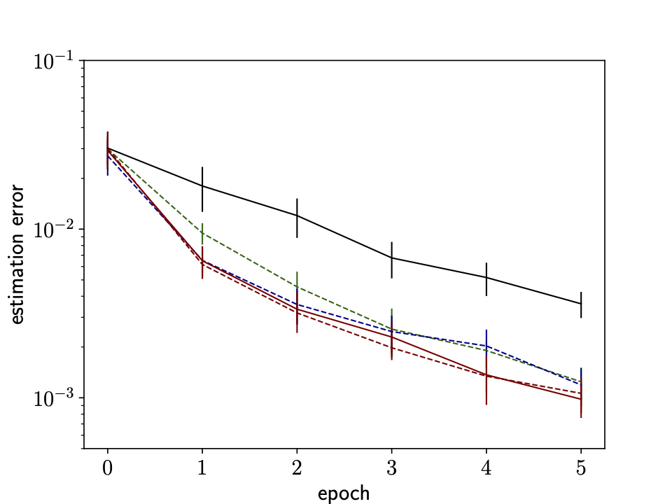
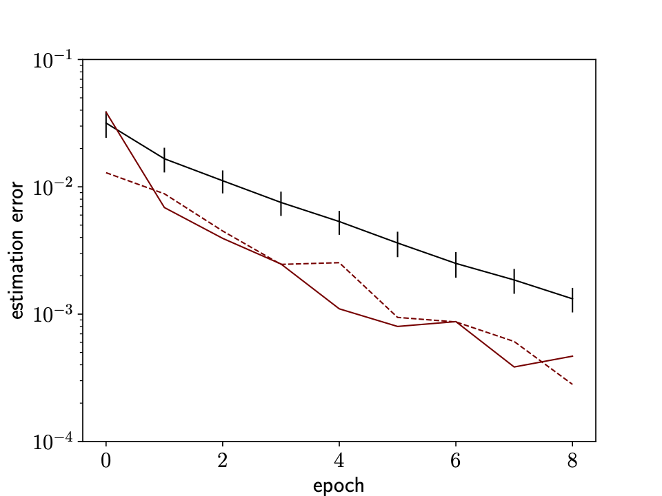
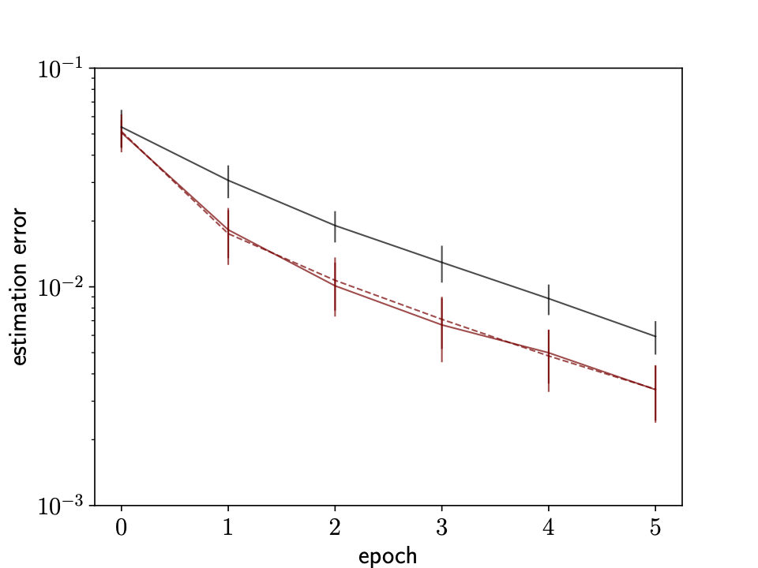

# Differentiable planning for system identification

## Usage


### Requirements
* Python 3
* torch>=1.9.0
* numpy
Install the required packages with `pip install -r requirements.txt`.


### Use our module


```python
from agents import Active

# ... 

 agent = Active(
     A,                         # dynamics matrix              
     T0,                        # initial time horizon
     d,                         # state space dimension
     gamma,                     # gamma**2 is the energy
     sigma,                     # size of the noise
     n_gradient,                # number of gradient steps per epoch
     optimality                 # optimality criterion, e.g. 'A', 'D', 'E', or 'T'
     )

# active learning for n_steps steps, evaluating on n_samples
estimations = agent.identify(n_epochs)
# estimations is a list of length n_epochs+1 containing numpy arrays of shape (d, d)

```


## Results

Scripts reproducing our experiments are provided in the directory `experiments`. Here are our results.





